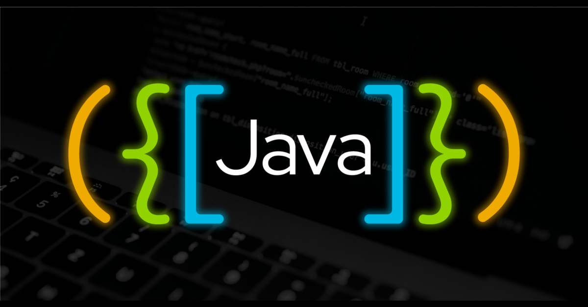

# Java-data-structures
## Introduction/summary
This repository contains code written to illustrate the use of various data structures and implementations of various algorithms.
Some of the data structures include:
- [Arrays](src/com/symon/arrays)
- [2D Arrays](src/com/symon/arrays)
- [Dynamic Arrays](src/com/symon/arrays)
- [LinkedLists](src/com/symon/generalDataStructures/Working_with_linkedLIsts.java)
- [Queues](src/com/symon/generalDataStructures/workingWithQueues.java)
- [Priority queues](src/com/symon/generalDataStructures/priorityQueues.java)
- [Hash tables](src/com/symon/generalDataStructures/WorkingWithHashTables.java)
- [Stacks](src/com/symon/generalDataStructures/workingWithStacks.java)

The algorithms covered include:
- sorting algorithms
    - [bubble sort](src/com/symon/sorting/BubbleSort.java)
    - [quick sort](src/com/symon/sorting/Quicksort.java)
    - [merge sort](src/com/symon/sorting/MergeSort.java)
    - [insertion sort](src/com/symon/sorting/InsertionSort.java)
    - [selection sort](src/com/symon/sorting/SelectionSort.java)
- searching algorithms
    - [interpolation search](src/com/symon/searches/InterpolationSearch.java)
    - [binary search](src/com/symon/searches/BinarySearch.java)
    - [linear search](src/com/symon/searches/LinearSearch.java)

I've also included some code and implementations on non-linear data structures such as:
- [adjacency lists](src/com/symon/adjacencyList)
- [adjacency matrices](src/com/symon/adjacencyMatrix)
- [binary search trees](src/com/symon/binarySearchTrees)
- [breadth first search](src/com/symon/breadthFirstSearch)
- [depth first search](src/com/symon/adjacencyMatrix)
## Usage
To use the codes in this repo in your computer, you'll need to clone this repository and move inside it.
You can use the following shell/terminal commands:
```shell
your@terminal:~$ git clone https://github.com/SymonMuchemi/Java-data-structures.git
your@terminal:~$ cd Java-data-structures
```
## Contribution
To make changes or any adjustments to this repo, feel free to create a pull request
